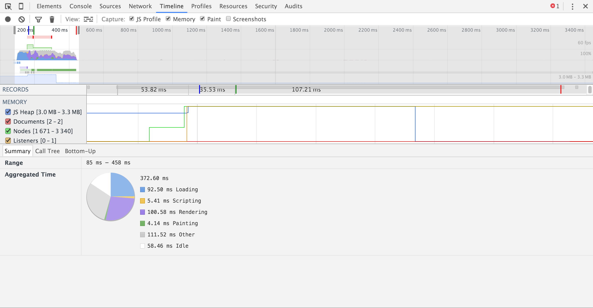

# LookLive

https://performance.dennisvanbennekom.com

## Verbeteringen
- Header image responsive en een stuk kleiner gemaakt.
- jQuery code omgezet naar vanilla js.
- CSS omgezet naar BEM voor snellere selector performance.

### Screenshots
**Voor**:


**Na**:


***

## Verbeteringen
- Inline SVG gebruikt ipv spritesheet, want dit scheelt een request en maakt het makkelijk om deze icons te stijlen.

### Screenshots
**Voor**:


**Na**:


## Verbeteringen
- One page app gemaakt mbv fetch.

### Screenshots
**Voor**:


**Na**:


# Progressive Web App
Google beschrijft eigenlijk heel goed wat een progressive web app is. Belangrijk is dat het als een app moet voelen, maar alsnog op elk apparaat werkt dat op het web kan. Vooral moeten ze progressive zijn. Web browsers die niet goed gesupport zijn moeten een basis versie kunnen krijgen. 

Een progressive web app is ook herkenbaar als app doordat je een icon moet kunnen maken op je homescreen en de app offline werkt door middel van service workers waarin de pagina gecached wordt.

Uiteindelijk gaat het erom dat het als een app aanvoelt, maar eigenlijk een website is en oudere devices of browsers ook een werkende versie krijgen en nieuwere steeds meer functionaliteiten hebben als ze dat ondersteunen.

### Bronnen
https://developers.google.com/web/progressive-web-apps?hl=en


## Verbeteringen
- Header image responsive en een stuk kleiner gemaakt.
- jQuery code omgezet naar vanilla js.
- CSS omgezet naar BEM voor snellere selector performance.

### Screenshots
**Voor**:


**Na**:


***

## Verbeteringen
- Inline SVG gebruikt ipv spritesheet, want dit scheelt een request en maakt het makkelijk om deze icons te stijlen.

### Screenshots
**Voor**:


**Na**:


## Verbeteringen
- One page app gemaakt mbv fetch.

### Screenshots
**Voor**:


**Na**:


## Verbeteringen
- Service worker die de pagina alvast ophaalt bij een mouseover.

### Screenshots
**Voor**:


**Na**:


## Taskmanagers

Taskmanagers zijn handige tools om je build proces te automatiseren. Er zijn een aardig wat verschillende build tools zoals:
- [gulp](http://gulpjs.com/)
- [grunt](http://gruntjs.com/)
- [webpack](https://webpack.github.io/)
- [npm](https://docs.npmjs.com/misc/scripts)

Zelf gebruik ik graag gulp voor front-end projecten of webpack als het een react of ander javascript gebaseerd project is. Soms is het ook handig om npm scripts te gebruiken als het maar hele kleine dingen zijn die je hoeft te automatiseren. Het voordeel hiervan is dat je niet speciale build tools hoeft te installeren, maar gewoon je package.json kan gebruiken.

De reden dat ik gulp zou kiezen in plaats van grunt is dat het veel minder configuratie is. Gulp is veel logischer voor mijn gevoel, omdat het een soort pipeline is waar je bestanden doorheen gestuurd worden en waar je ondertussen bewerkingen op doet. [bron](https://medium.com/@preslavrachev/gulp-vs-grunt-why-one-why-the-other-f5d3b398edc4).

Voor dit project kies ik er voor om gulp te gebruiken, omdat ik denk dat de dingen die ik ermee wil doen te veel zijn voor npm scripts, die dan veel minder overzichtelijk worden. Ik kies niet voor webpack omdat ik dat voor een project als dit niet fijn vind werken en ik niet echt gebruik wil maken van `import` dingen.

## Gulpfile

Ik heb tasks gemaakt voor de dingen die het belangrijksts zijn om te optimizen:

### Styles

De verbeteringen die ik hier doe is vooral de cssnano stap. Die minified het css bestand zodat het zo klein mogelijk is. Ook gebruik ik autoprefixer zodat alle prefixes die er misschien nodig zijn erin komen te staan.

```js
gulp.task('styles', function() {
  return gulp.src('src/styles/**/*.css')
    .pipe(sourcemaps.init())
    .pipe(concat('style.css'))
    .pipe(autoprefixer('last 1 version'))
    .pipe(cssnano())
    .pipe(sourcemaps.write('.'))
    .pipe(gulp.dest('public/styles'))
    .pipe(browserSync.stream());
});
```

### Scripts

Deze lijkt heel erg op de styles taks, alleen maak ik hier gebruik van uglify om de code zo compact mogelijk te krijgen.

```js
gulp.task('scripts', function() {
  return gulp.src('src/js/**/*.js')
    .pipe(sourcemaps.init())
    .pipe(concat('app.js'))
    .pipe(uglify())
    .pipe(sourcemaps.write('.'))
    .pipe(gulp.dest('public/js'));
});
```

### Images 

Ik gebruik hier imagemin om de images zo klein mogelijk te krijgen zonder al te veel kwaliteit te verliezen. Ook maak ik hier gebruik van de gulp-cache plugin die ervoor zorgt dat afbeeldingen die al een keer geoptimaliseerd zijn niet nog een keer erdoor heen gaan. 

```js
gulp.task('images', function() {
  return gulp.src('src/images/**/*')
    .pipe(cache(imagemin({
      optimizationLevel: 3,
      progressive: true,
      interlaced: true
    })))
    .pipe(gulp.dest('public/images'));
});
```

### Serve

Deze task start ik als ik een lokale server wil starten met live reload, dit maakt het developen een stuk fijner.

```js
gulp.task('scripts-watch', ['scripts'], browserSync.reload);
gulp.task('images-watch', ['images'], browserSync.reload);

gulp.task('serve', ['build'], function() {
  browserSync.init({
    proxy: 'localhost:3000'
  })

  gulp.watch('src/styles/**/*.css', ['styles']);
  gulp.watch('src/js/**/*.js', ['scripts-watch']);
  gulp.watch('src/images/**/*', ['images-watch']);
  gulp.watch('views/**/*.hbs').on('change', browserSync.reload);
});
```

### Build

De build task gebruik ik om een productie versie te maken

```js
gulp.task('build', function() {
  gulp.start('styles', 'scripts', 'images');
});

gulp.task('default', ['build']);
```

## Optimaliseer web font

Voor het optimaliseren van de web font heb ik [Web Font Loader](https://github.com/typekit/webfontloader) gebruikt. Hiermee is het mogelijk om web fonts async in te laden en wordt een class toegevoegd aan het html element zodra het font geladen is.

```js
WebFont.load({
  google: {
    families: ['Raleway:latin'] // Subsetting
  }
});
```

```css
body {
    font: 14px Helvetica, Arial, sans-serif;
    background-color: #f1f1f1;
    margin: 0;
}

/* Use the google font when it is available */
.wf-active body {
  font: 14px Raleway, Helvetica, Arial, sans-serif;
}
```

Standaard laad ik dus gewoon Helvetica etc. in, maar zodra de fonts geladen zijn kan ik Raleway gebruiken.

## Screenshots

### Voor


### Na


# Conclusie

Doormiddel van alle bovenstaande verbeteringen is de site een stuk beter geoptimaliseerd en is de gebruikerservaring verbeterd.

### Begin


### Eind
