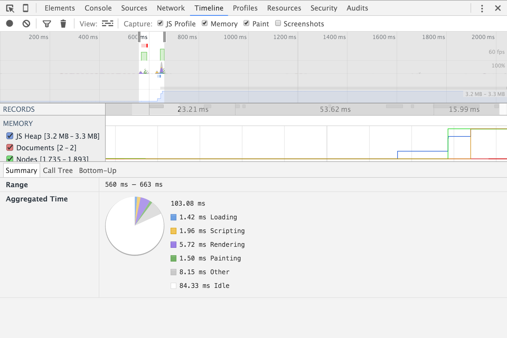

# LookLive

## Progressive Web App
Google beschrijft eigenlijk heel goed wat een progressive web app is. Belangrijk is dat het als een app moet voelen, maar alsnog op elk apparaat werkt dat op het web kan. Vooral moeten ze progressive zijn. Web browsers die niet goed gesupport zijn moeten een basis versie kunnen krijgen. 

Een progressive web app is ook herkenbaar als app doordat je een icon moet kunnen maken op je homescreen en de app offline werkt door middel van service workers waarin de pagina gecached wordt.

Uiteindelijk gaat het erom dat het als een app aanvoelt, maar eigenlijk een website is en oudere devices of browsers ook een werkende versie krijgen en nieuwere steeds meer functionaliteiten hebben als ze dat ondersteunen.

### Bronnen
https://developers.google.com/web/progressive-web-apps?hl=en

## Verbeteringen
- Header image responsive en een stuk kleiner gemaakt.
- jQuery code omgezet naar vanilla js.
- CSS omgezet naar BEM voor snellere selector performance.

## Screenshots
**Voor**:

**Na**:

***

# Verbeteringen
- Inline SVG gebruikt ipv spritesheet, want dit scheelt een request en maakt het makkelijk om deze icons te stijlen.

## Screenshots
**Voor**:

**Na**:

# Verbeteringen
- One page app gemaakt mbv fetch.

## Screenshots
**Voor**:

**Na**:

# Verbeteringen
- Service worker die de pagina alvast ophaalt bij een mouseover.

## Screenshots
**Voor**:

**Na**:

